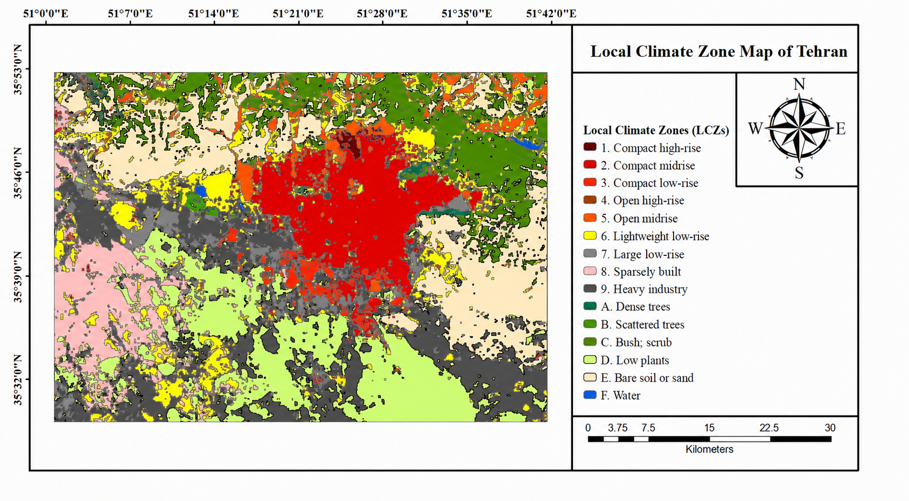

# Tehran Local Climate Zone Mapping

Remote-sensing-based mapping of Tehran’s Local Climate Zones using Landsat 8 imagery and GIS software.

## Final LCZ Map

## Project Overview

This geospatial project was completed for Tehran Municipality and its Urban Development and Construction Organization to produce a city-wide Local Climate Zone (LCZ) map from 2018 Landsat 8 imagery at 30-meter spatial resolution. The workflow combined ENVI, SAGA GIS, and ArcGIS for image preparation, LCZ classification, accuracy assessment, and final map production.

The final classification identified 15 of the 17 standard LCZ classes across the study area.

## Project Contribution

My work covered Landsat 8 image preparation, creation of training polygons, Local Climate Zone classification, independent accuracy assessment, and preparation of the final GIS deliverables in GeoTIFF and KMZ formats.

## Objectives

- Produce a Local Climate Zone map of Tehran.
- Classify different urban forms and land-cover types.
- Evaluate the reliability of the final classification.
- Export the results in GIS and Google Earth formats.

## Data and Software

| Item | Details |
|---|---|
| Satellite data | Landsat 8 imagery |
| Image year | 2018 |
| Spatial resolution | 30 m |
| ENVI | Satellite image preparation and preprocessing |
| SAGA GIS | Local Climate Zone classification |
| ArcGIS | Accuracy assessment, spatial analysis, and final map preparation |

## LCZ Class Legend

| Code | Local Climate Zone |
|---|---|
| 1 | Compact high-rise |
| 2 | Compact mid-rise |
| 3 | Compact low-rise |
| 4 | Open high-rise |
| 5 | Open mid-rise |
| 7 | Lightweight low-rise |
| 8 | Large low-rise |
| 9 | Sparsely built |
| 10 | Heavy industry |
| 101 (A) | Dense trees |
| 102 (B) | Scattered trees |
| 103 (C) | Bush and scrub |
| 104 (D) | Low plants |
| 106 (F) | Bare soil or sand |
| 107 (G) | Water |

## Workflow

1. Prepared and preprocessed 2018 Landsat 8 imagery in ENVI.
2. Created 515 training polygons representing the target Local Climate Zone classes.
3. Performed Local Climate Zone classification in SAGA GIS.
4. Conducted spatial analysis and prepared the final map in ArcGIS.
5. Evaluated the classification using 363 independent reference samples, with 306 correctly classified samples.
6. Exported the final results as GeoTIFF and KMZ files for municipal spatial analysis and visualization.

## Results

The final classification identified 15 of the 17 standard Local Climate Zone classes across Tehran.

| Metric | Result |
|---|---:|
| Identified LCZ classes | 15 of 17 standard classes |
| Training polygons | 515 |
| Independent validation samples | 363 |
| Correctly classified samples | 306 of 363 |
| Overall accuracy | 84.30% |
| Kappa coefficient | 0.83 |

The final outputs were exported as GeoTIFF and KMZ files for municipal spatial analysis and visualization.

## Repository Contents

- [`TEHRAN_LCZ_MAP.tif`](./TEHRAN_LCZ_MAP.tif) — Final LCZ map in GeoTIFF format.
- [`tehran_lcz_map.kmz`](./tehran_lcz_map.kmz) — Final map for visualization in Google Earth.
- [`accuracy_assessment.txt`](./accuracy_assessment.txt) — Confusion matrix and detailed accuracy-assessment results.

## Data Availability

This repository contains the principal project outputs. Raw satellite imagery and original training and testing datasets are not included because of file-size and data-sharing considerations.

## Project Context

This municipal geospatial mapping project was completed for Tehran Municipality and its Urban Development and Construction Organization.

## Author

Ali Moeinkhah
